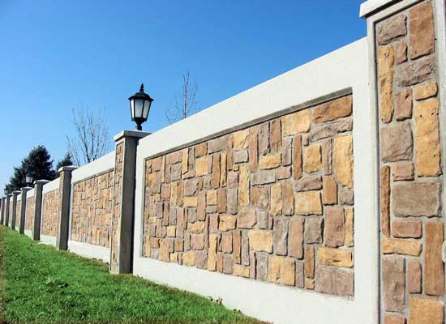
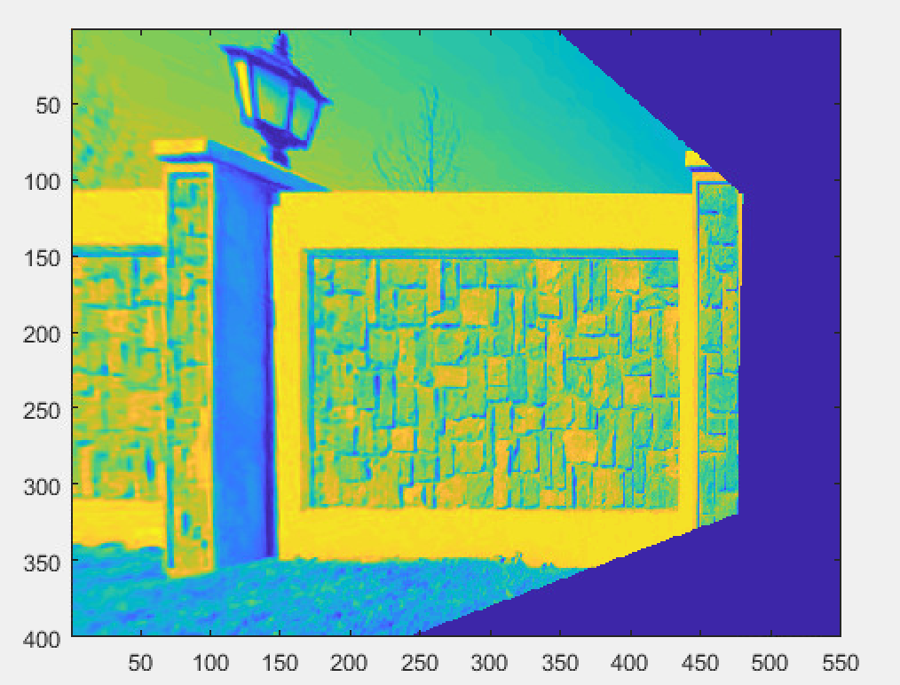
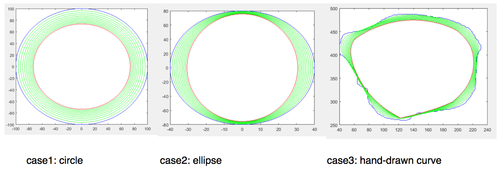
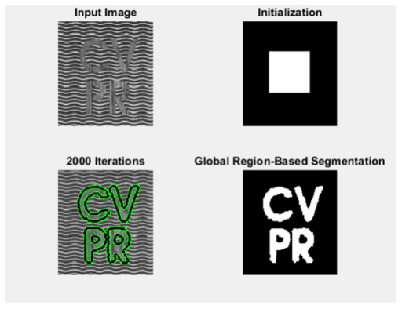

# ComputerVision

Programs in matlab for specific computer vision problems

as1q1.m - compute homographies and removing planar perspective distortion from any image
input image

output image

as1q2.m - compute height ratios of objects (uses vanishing points and vanishing lines)

as1q3.m - compute camera caliberation parameters and all internal variables

curvatureFlow.m - applying the curvature flow delC/delt = -k.n to a curve, and allowing it to shrink

tensorBasedKmeansDemo.m --> tensorBasedKmeans.m - does segmentation of images using structure tensor based aproach to K-means , using form parameter as distance type (J-divergance and eucliidean distance) 

region_seg_demo.m-->region_seg.m - Implements the paper "An Affine Invariant Tensor Dissimilarity Measure and its Applications to Tensor-valued Image Segmentation ?" (structure tensor and J-divergance based segmentation on top of chan-vesse algorithm)

